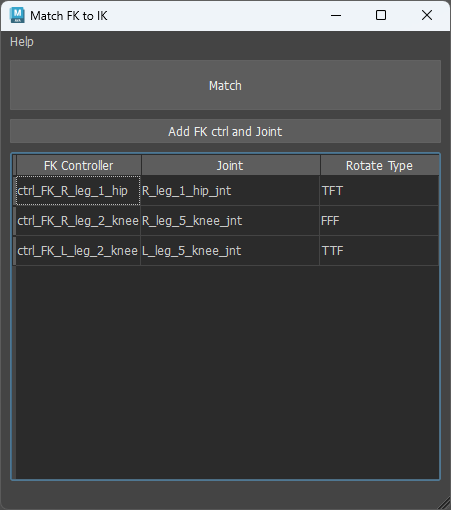
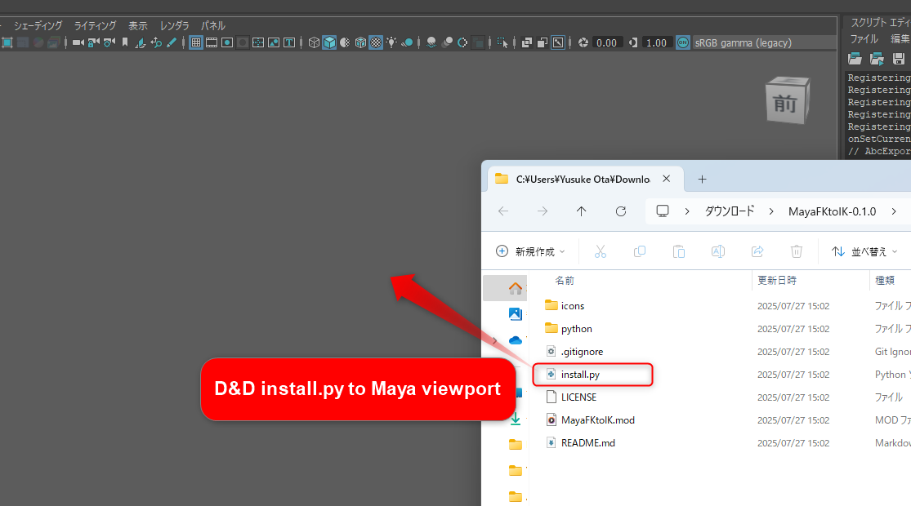
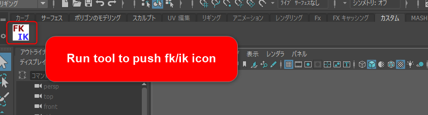

# Match FK to IK

## 概要

- フリーリグ等でIKコントローラーとFKコントローラーが連動していないものに対して、IKで動かした位置にFKコントローラーをマッチさせるツールです
- ※ ただし、FKコントローラーがいずれかのスケルトンと連動していることが条件です。

## 動作要件

- Maya2025以上（使用しているPySideがPySide6なため）

## インストール方法

1. ダウンロードしてください。（https://github.com/yus3554/MayaFKtoIK/releases）
2. 解凍してinstall.pyをMayaのビューポートにドラッグアンドドロップしてください。
3. カスタムシェルフにアイコンが追加されるので、そこからツールを起動してください。

## 使い方

### 初期設定

1. ツールを適用したいシーンを開いてください。
2. ツールを適用したい関節をすべてFK状態にしてください。
3. ジョイントをビューポートに表示してください。
4. ツールを起動してください。
5. FKコントローラーと、FKコントローラーに連動しているジョイントを順に選択し、**Add FK ctrl and Joint**ボタンを押してください。ツールの表に登録されます。
6. 登録された行の**Rotate Type**をダブルクリックしてください。Rotate Type調整用のダイアログが開きます。
7. ダイアログ上のボタンを押すと、ビューポート上のコントローラーが移動します。**押しても変化がないボタン**を選択して**OK**を押してください。
8. 5 ~ 7を、必要なFKコントローラーごとに行ってください。

### マッチ実行

1. ツールを適用したい関節をIK状態にしてください。
2. 初期設定が終わった行を選択し、**Match**ボタンを押してください。設定された内容でマッチが実行されます。
3. マッチ後は、FK状態にしてもIKと同じ位置が保持されています。
